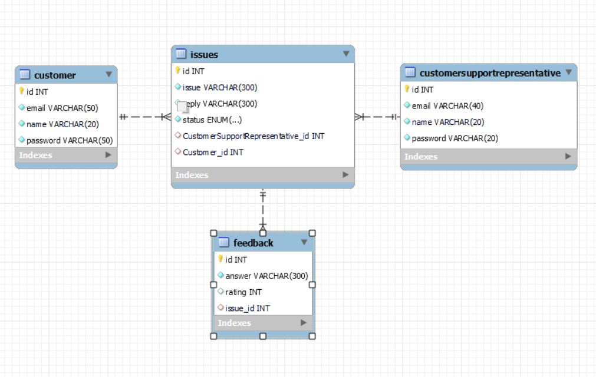

# screeching-circle-1069 (Customer Relationship Management Software)

This project is a Customer Relationship Management (CRM) software application that helps manage interactions and relationships between customers and customer support representatives. It is built using Java, JPA, Hibernate, and SQL as the technology stack.

## Key Features

- **Customer Role:**
  - Register a new account.
  - Log in to the system.
  - Raise issues and provide necessary details.
  - View the status of the raised issues.
  - Provide feedback on closed issues.
  - Change account password.
  - Delete the account.

- **Customer Support Representative Role:**
  - Log in to the system.
  - Register a new account.
  - Delete the account.
  - Change account password.
  - View and reply to customer issues.
  - View customer feedback.
## ER-Diagram

## Tech Stack

The CRM software is developed using the following technologies:

- Java: The programming language used for the backend development.
- JPA (Java Persistence API): A Java specification for object-relational mapping.
- Hibernate: A popular ORM (Object-Relational Mapping) framework.
- SQL: The standard language for managing and querying databases.

## Usage

1. Register a new account as a customer or customer support representative.
2. Log in using your credentials.
3. Explore the features based on your role (customer or customer support representative).
4. Follow the intuitive user interface to raise issues, provide feedback, view and reply to issues, etc.
5. Remember to securely manage your account, change your password, or delete the account if needed.

## Contributing

Contributions to this project are welcome. If you have any ideas, suggestions, or bug reports, please create an issue or submit a pull request.
